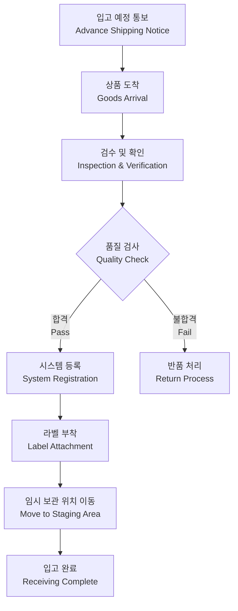
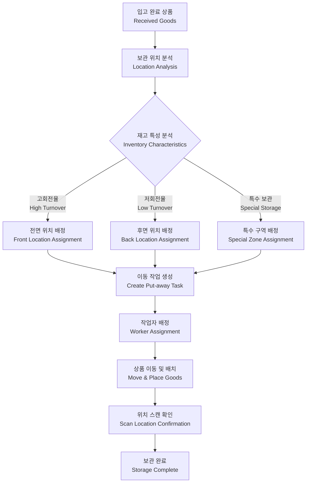
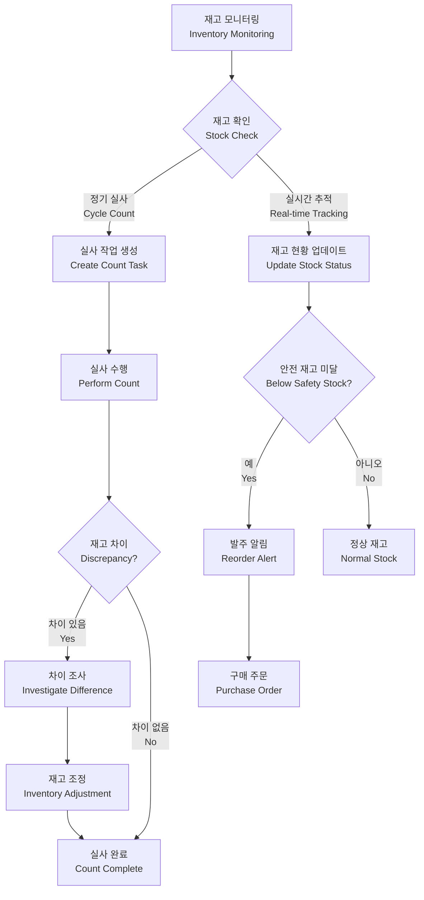
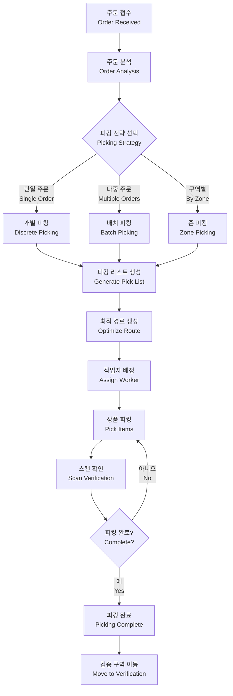
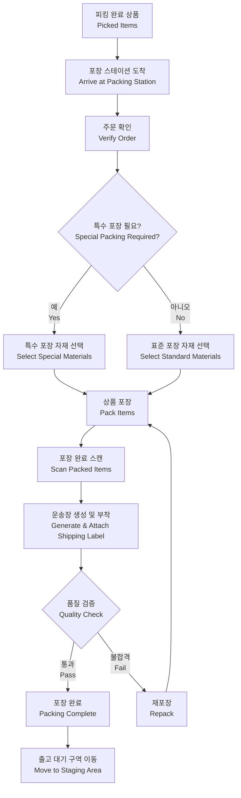
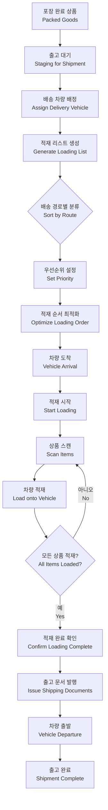
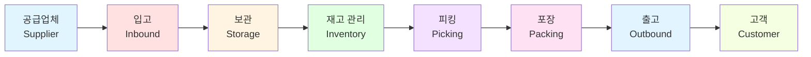

# WMS-flow

WMS의 플로우 차트를 설명한 프로젝트입니다.

This project explains the flow charts of a Warehouse Management System (WMS).

## 목차 / Table of Contents

1. [프로젝트 개요 / Project Overview](#프로젝트-개요--project-overview)
2. [WMS란? / What is WMS?](#wms란--what-is-wms)
3. [주요 프로세스 / Main Processes](#주요-프로세스--main-processes)
   - [입고 프로세스 / Inbound Process](#입고-프로세스--inbound-process)
   - [보관 프로세스 / Storage Process](#보관-프로세스--storage-process)
   - [재고 관리 / Inventory Management](#재고-관리--inventory-management)
   - [피킹 프로세스 / Picking Process](#피킹-프로세스--picking-process)
   - [포장 프로세스 / Packing Process](#포장-프로세스--packing-process)
   - [출고 프로세스 / Outbound Process](#출고-프로세스--outbound-process)

## 프로젝트 개요 / Project Overview

이 프로젝트는 창고 관리 시스템(WMS)의 주요 프로세스와 워크플로우를 시각적인 플로우차트로 설명합니다. 각 프로세스는 Mermaid 다이어그램을 사용하여 표현되며, 물류 및 창고 운영의 효율성을 이해하는 데 도움을 줍니다.

This project provides visual flowcharts that explain the main processes and workflows of a Warehouse Management System (WMS). Each process is represented using Mermaid diagrams to help understand the efficiency of logistics and warehouse operations.

## WMS란? / What is WMS?

**창고 관리 시스템(Warehouse Management System, WMS)**은 창고 내의 재고 이동과 저장을 최적화하고 관리하는 소프트웨어 애플리케이션입니다. WMS는 입고, 보관, 피킹, 포장, 출고 등 창고 운영의 전 과정을 체계적으로 관리합니다.

**Warehouse Management System (WMS)** is a software application that optimizes and manages inventory movement and storage within a warehouse. WMS systematically manages all aspects of warehouse operations including receiving, storage, picking, packing, and shipping.

### 주요 기능 / Key Features

- 실시간 재고 추적 / Real-time inventory tracking
- 위치 관리 최적화 / Location management optimization
- 작업 효율성 향상 / Improved operational efficiency
- 정확한 주문 처리 / Accurate order fulfillment
- 데이터 기반 의사결정 / Data-driven decision making

## 주요 프로세스 / Main Processes

### 입고 프로세스 / Inbound Process

입고 프로세스는 공급업체로부터 상품을 받아 창고에 등록하는 과정입니다.

The inbound process involves receiving products from suppliers and registering them in the warehouse.

#### 프로세스 설명 / Process Description

1. **입고 예정 통보**: 공급업체로부터 입고 예정 정보를 받습니다
2. **상품 도착**: 실제 상품이 창고에 도착합니다
3. **검수 및 확인**: 수량과 상품 상태를 확인합니다
4. **품질 검사**: 상품의 품질을 검사합니다
5. **시스템 등록**: 합격한 상품을 WMS에 등록합니다
6. **라벨 부착**: 바코드 또는 RFID 라벨을 부착합니다
7. **임시 보관**: 보관 위치 배정 전까지 임시 보관합니다

### 보관 프로세스 / Storage Process

보관 프로세스는 입고된 상품을 최적의 위치에 저장하는 과정입니다.

The storage process involves storing received products in optimal locations.

#### 프로세스 설명 / Process Description

1. **보관 위치 분석**: 상품 특성에 따라 최적의 보관 위치를 결정합니다
2. **재고 특성 분석**: 회전율, 크기, 무게, 특수 요구사항 등을 분석합니다
3. **위치 배정**: 분석 결과에 따라 적절한 위치를 배정합니다
4. **이동 작업 생성**: 시스템에서 Put-away 작업을 생성합니다
5. **상품 배치**: 작업자가 상품을 지정된 위치에 배치합니다
6. **확인**: 바코드 스캔으로 정확한 위치에 보관되었는지 확인합니다

### 재고 관리 / Inventory Management

재고 관리 프로세스는 창고 내 재고를 지속적으로 모니터링하고 관리하는 과정입니다.

The inventory management process continuously monitors and manages warehouse inventory.

#### 프로세스 설명 / Process Description

1. **재고 모니터링**: 실시간으로 재고 수준을 모니터링합니다
2. **정기 실사**: 주기적으로 물리적 재고를 확인합니다
3. **재고 조정**: 차이가 발견되면 조사하고 시스템을 조정합니다
4. **안전 재고 관리**: 재고가 안전 수준 이하로 떨어지면 발주를 진행합니다

### 피킹 프로세스 / Picking Process

피킹 프로세스는 주문에 따라 창고에서 상품을 수집하는 과정입니다.

The picking process involves collecting products from the warehouse according to orders.

#### 프로세스 설명 / Process Description

1. **주문 분석**: 주문 내용과 수량을 분석합니다
2. **피킹 전략 선택**: 주문 특성에 따라 최적의 피킹 방법을 선택합니다
   - **개별 피킹**: 주문별로 개별 피킹
   - **배치 피킹**: 여러 주문을 한 번에 피킹
   - **존 피킹**: 구역별로 분담하여 피킹
3. **최적 경로 생성**: 이동 거리를 최소화하는 경로를 생성합니다
4. **피킹 실행**: 작업자가 상품을 수집합니다
5. **확인**: 각 상품을 스캔하여 정확성을 확인합니다

### 포장 프로세스 / Packing Process

포장 프로세스는 피킹된 상품을 안전하게 포장하는 과정입니다.

The packing process involves safely packaging picked products.

#### 프로세스 설명 / Process Description

1. **주문 확인**: 피킹된 상품이 주문과 일치하는지 확인합니다
2. **포장 자재 선택**: 상품 특성에 맞는 포장 자재를 선택합니다
3. **포장**: 상품을 안전하게 포장합니다
4. **운송장 부착**: 배송 정보가 포함된 운송장을 생성하고 부착합니다
5. **품질 검증**: 포장 상태를 최종 확인합니다

### 출고 프로세스 / Outbound Process

출고 프로세스는 포장된 상품을 배송 차량에 적재하는 과정입니다.

The outbound process involves loading packed products onto delivery vehicles.

#### 프로세스 설명 / Process Description

1. **배송 차량 배정**: 배송 경로와 물량에 따라 차량을 배정합니다
2. **적재 리스트 생성**: 차량별 적재할 상품 목록을 생성합니다
3. **배송 경로별 분류**: 배송 경로에 따라 상품을 분류합니다
4. **적재 순서 최적화**: 배송 순서를 고려하여 적재 순서를 결정합니다
5. **적재 및 확인**: 상품을 스캔하며 차량에 적재합니다
6. **출고 문서 발행**: 출고 관련 서류를 발행합니다

## 통합 워크플로우 / Integrated Workflow

전체 WMS 프로세스의 통합 흐름을 보여줍니다.

This shows the integrated flow of the entire WMS process.

## 사용 방법 / How to Use

이 문서의 플로우차트는 GitHub에서 자동으로 렌더링됩니다. 각 프로세스의 플로우차트를 참고하여 WMS 시스템의 워크플로우를 이해할 수 있습니다.

The flowcharts in this document are automatically rendered on GitHub. You can refer to each process flowchart to understand the WMS system workflow.

### Mermaid 다이어그램 수정 / Editing Mermaid Diagrams

Mermaid 다이어그램을 수정하려면:
1. README.md 파일을 편집합니다
2. \`\`\`mermaid 블록 내의 코드를 수정합니다
3. [Mermaid Live Editor](https://mermaid.live)에서 미리 확인할 수 있습니다

To edit Mermaid diagrams:
1. Edit the README.md file
2. Modify the code within the \`\`\`mermaid blocks
3. Preview at [Mermaid Live Editor](https://mermaid.live)

## 참고 자료 / References

- [Mermaid Documentation](https://mermaid.js.org/)
- [WMS Best Practices](https://www.warehousingandfulfillment.com/warehouse-management/warehouse-management-systems/)

## 라이선스 / License

This project is open source and available for educational purposes.

## 기여 / Contributing

프로젝트 개선을 위한 기여를 환영합니다. Pull Request를 통해 참여해 주세요.

Contributions to improve the project are welcome. Please participate through Pull Requests.